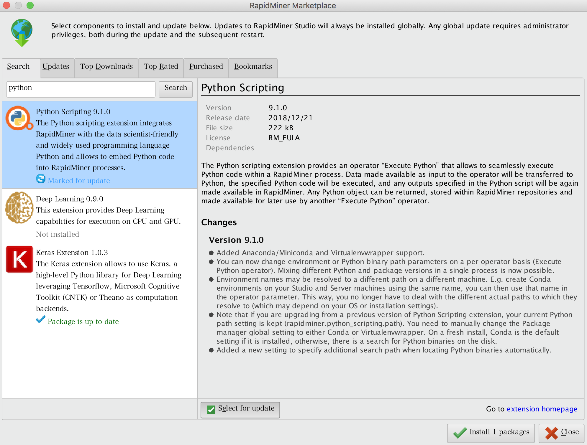
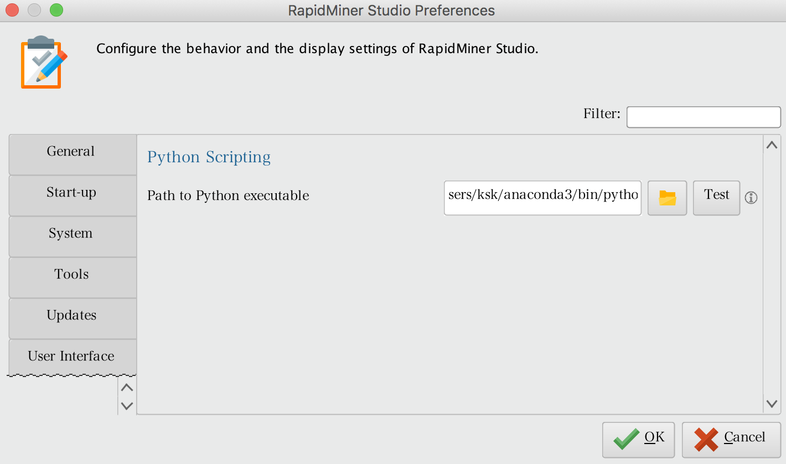
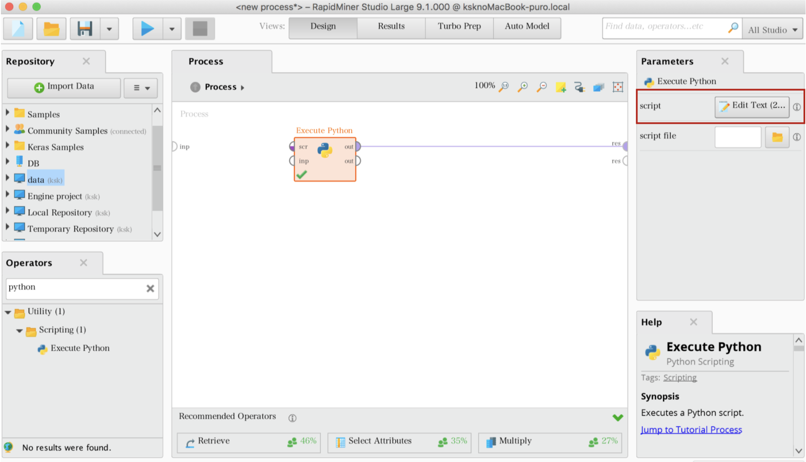
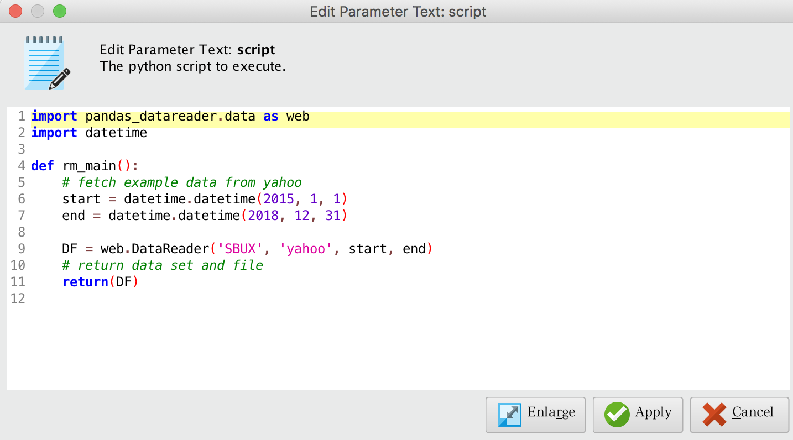
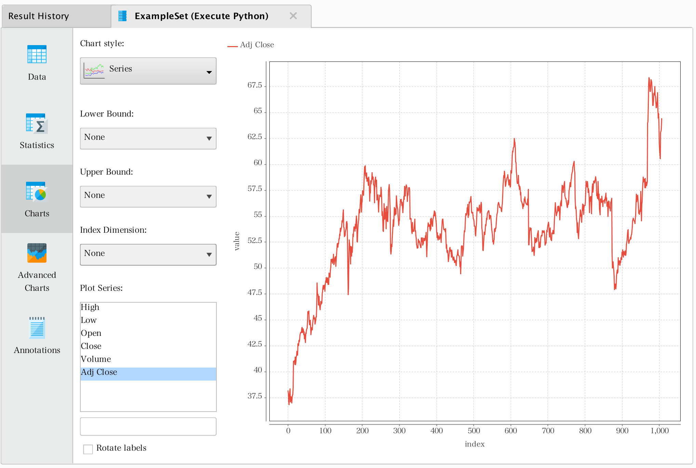

# 拡張機能活用
　2019年3月現在（RapidMiner Studio Ver9.1)において、分析を加速させる多くのオペレータが提供されている。その現状に満足できない場合、拡張機能を使うことで解決できる場合がある。  
  
　代表的な拡張機能としては、PythonのコードをRapidMiner上で実行するための「Python Execute」、同様にRのコードをRapidMiner上で実行するための「R Execute」がある。Python、Rは、機械学習をはじめとするデータマイニング（データ分析）を行う際に最も多く使用されているプログラミング言語である。そのため、PythonやRをRapidMiner上で実行したいという要望も多く聞かれる。そこで、本章では、まずPythonやRをRapidMiner上で実行するための環境設定について解説を行う。   

　次にRapidMinerが機械学習を行うための総合分析プラットフォームであるがゆえに、高度な機械学習を求める読者もいるものと思われる。機械学習でモデリングを行うために149ものアルゴリズム（オペレーター）が用意されているが、機械学習を生業とするもの中には物足りなく感じる分析者もいるだろう。本章の後半では、オープンソースニューラルネットワークライブラリである「Keras」の拡張機能についても紹介する。

## インデックス
- <a href="#Pythonへの拡張">Pythonへの拡張</a>
- <a href="#Rへの拡張">Rへの拡張</a>
- <a href="#Kerasへの拡張">Kerasへの拡張</a>


## Pythonへの拡張
　まず、Pythonへの拡張を行うための前提条件として、以下の2点を満たしておく必要がある。
* Pythonが使用しているマシンにインストールされている。 
* Pandas がインストールされている。

　上記が満たされていることを確認できれば、環境設定に進む。まずはじめに、RapidMiner Studioの`Extentions`よりPython Executeをインストールする。Searchボックスの中に`Python`と入力するとPython Executeが表示される。Python Executeを選択し、`Select for　Update`にチェックを入れ、Install 1 packageをクリックする。すると、Python Executeのインストールが実行される。  



　Pythonを実行できるようにするめに、RapidMinerとPythonの間のpathをつないでおく必要がある。この設定は、`Preferance`より設定を行う。Pythonの在りかが判明しない場合は、ターミナルで下記のコマンドを入力、実行するとよい。

```
$ which python
/Users/ksk/anaconda3/bin/python
```
 pathが設定できれば、PyhonをRapidMiner上で実行できる環境が整った。RapidMinerを再起動することでPythonが実行できる。
 


　pythonがRapidMiner上で動作するかを確認するため、ここでは`pandas-datareader`を使って株価データを抽出し、対象データを可視化することを試みる。上述の通り設定できていれば、オペレーターの検索ボックスに`Python`と入力すれば、`Python　Execute`が表示される。同オペレーターをドラッグ&ドロップし、画面上に配置する。`Python　Execute`のパラメータ設定項目に`Edit　Text`があり、クリックするとpythonのコードが記述できる。



　ここでは、例としてスターバックス社（Starbucks Corporation、NASDAQ: SBUX）の2015年1月1日〜2018年12月31日までの株価データを抽出する。`web.DataReader()`の第2引数では、データの取得ソースを指定することができ、Google Finance、Morningstar、Quandlなどが指定できる。今回は、yahoo Financeを指定する。



```python
import pandas_datareader.data as web
import datetime

def rm_main():
    # fetch example data from yahoo
    start = datetime.datetime(2015, 1, 1)
    end = datetime.datetime(2018, 12, 31)

    DF = web.DataReader('SBUX', 'yahoo', start, end)
    # return data set and file
    return(DF)
```

　実行結果を可視化（Time Series）すると下記のようになる。縦軸は株価（ドル）、横軸は時間軸（2015年1月1日）となっており、日毎のデータが取得できていることが確認できる。取引量（Volume）のデータも取得できているので、こちらも可視化してみるといいだろう。




## Rへの拡張

## Kerasへの拡張

